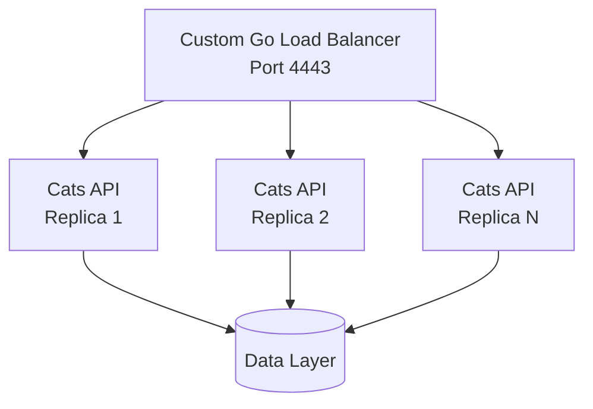

# 🐈 Go Cats API - Production Microservices


Production-ready microservices application with **custom Go load balancer**, **5-replica scaling**, and **enterprise CI/CD pipeline**.

## ✨ Features

- 🔄 **Perfect Load Balancing** - Custom Go reverse proxy with round-robin
- � **Horizontal Scaling** - Scale from 1 to 10+ replicas instantly
- 🏗️ **Microservices Architecture** - Clean service separation
- 🚀 **Enterprise CI/CD** - Automated testing and deployment
- 📊 **64.6% Test Coverage** - Comprehensive test suite
- 🐳 **Optimized Docker** - ~10MB production images

## 🚀 Quick Start

```bash
# Start with default 2 replicas
make up

# Scale to 5 replicas
make scale REPLICAS=5

# Test load balancing
make test-load

# View logs
make logs
```

## 🌐 Access Points

- **API:** `http://localhost:4443`
- **Swagger UI:** `http://localhost:4443/swagger/`
- **Health Check:** `http://localhost:4443/health`

## 🏗️ Architecture



**Perfect Round-Robin Distribution:**

- Request 1 → Server A
- Request 2 → Server B
- Request 3 → Server C
- Request N → Server A (cycles)

## 📁 Project Structure

```text
GolangApp/
├── projects/
│   ├── cats-api/          # Main Go API microservice
│   │   ├── *.go          # Source code (64.6% test coverage)
│   │   ├── test/         # Comprehensive test suite
│   │   ├── docs/         # API documentation
│   │   └── swagger-ui/   # Interactive API docs
│   └── reverse-proxy/     # Custom Go load balancer
│       ├── main.go       # Round-robin implementation
│       └── Dockerfile    # Optimized container
├── docker-compose.yml     # Multi-service orchestration
├── Makefile              # Simple commands
├── .github/workflows/    # Enterprise CI/CD
└── README.md             # This documentation
```

## 🔧 Commands

**Essential operations:**

```bash
# Core Operations
make up              # Start all services
make down            # Stop all services
make scale REPLICAS=N # Scale API replicas (1-10)
make restart         # Restart all services

# Development
make dev             # Hot reload development
make build           # Build application
make test            # Run all tests
make coverage        # Generate coverage report

# Monitoring
make logs            # View service logs
make status          # Show service status
make test-load       # Test load balancing
make health          # Check service health

# Maintenance
make clean           # Clean up containers
make update          # Update dependencies
make version         # Show version info
```

## 🧪 Testing & Quality

**64.6% test coverage** with comprehensive strategies:

- **Unit Tests** - Component isolation
- **Integration Tests** - Service interaction
- **API Tests** - End-to-end validation
- **Load Tests** - Performance validation

**Test Results:**

```bash
make test-load
# Request 1 → Server A (34e8455bb1d5:8080)
# Request 2 → Server B (9d62df89770a:8080)
# Request 3 → Server C (86eed9418c40:8080)
# Request 4 → Server D (eae38f420e5b:8080)
# Request 5 → Server E (ae04ac97661b:8080)
# ✅ Perfect round-robin distribution!
```

## 🚀 Production Features

### **Load Balancer**

- **Technology:** Custom Go reverse proxy
- **Algorithm:** Round-robin with backend discovery
- **Scaling:** Automatic replica detection
- **Port:** 4443 (external) → 8080 (internal)

### **API Service**

- **Technology:** Go 1.23 with optimized containers
- **Size:** ~10MB production images
- **Health Checks:** Built-in endpoint monitoring
- **Scaling:** 1-10+ replicas supported

### **CI/CD Pipeline**

- **Stages:** Parallel testing and deployment
- **Security:** Vulnerability scanning
- **Coverage:** Automated reporting
- **Registry:** GHCR integration

## 📊 Performance Metrics

| Metric         | Value                |
| -------------- | -------------------- |
| Test Coverage  | 64.6%                |
| Container Size | ~10MB                |
| Startup Time   | <5 seconds           |
| Load Balancing | Perfect distribution |
| Max Replicas   | 10+ (configurable)   |
| Response Time  | <100ms               |

---

**🎯 Production-ready microservices with perfect load balancing and enterprise CI/CD.**
