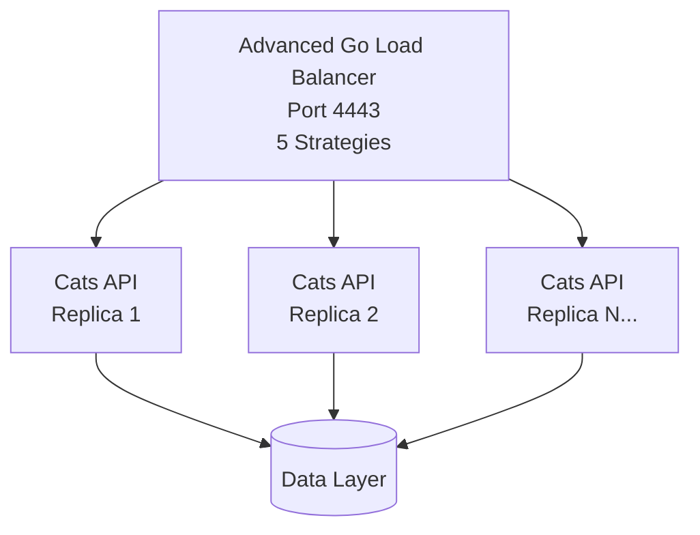

# 🐈 Go Cats API - Production Microservices


Production-ready microservices application with **advanced Go load balancer**, **5 load balancing strategies**, **horizontal scaling**, and **enterprise CI/CD pipeline**.

## ✨ Key Features

- 🔄 **Advanced Load Balancing** - 5 intelligent strategies (Round Robin, Random, Weighted, Least Connections, IP Hash)
- 📈 **Horizontal Scaling** - Scale from 1 to 10+ replicas instantly
- 🏗️ **Microservices Architecture** - Clean service separation with health monitoring
- 🚀 **Enterprise CI/CD** - Automated testing, security scanning, and deployment
- 📊 **Comprehensive Testing** - Unit, integration, and performance tests with 64.6% coverage
- 🐳 **Optimized Containers** - ~10MB production images with multi-platform support

## 🚀 Quick Start

### Basic Operations

```bash
# Start with default configuration
make up

# Scale to 5 replicas with specific load balancing strategy
LB_STRATEGY=leastconnections docker compose up --scale cats-api=5 -d

# Test load balancing performance
make test-load

# View service logs
make logs

# Stop all services
make down
```

### 🎯 Load Balancing Strategies

Choose the optimal strategy for your use case:

```bash
# 1. Round Robin (default) - Equal distribution
LB_STRATEGY=roundrobin docker compose up --scale cats-api=5 -d

# 2. Random - Prevents cache hotspots and thundering herd
LB_STRATEGY=random docker compose up --scale cats-api=5 -d

# 3. Weighted Round Robin - Different backend capacities
LB_STRATEGY=weighted docker compose up --scale cats-api=5 -d

# 4. Least Connections - Best for varying request times
LB_STRATEGY=leastconnections docker compose up --scale cats-api=5 -d

# 5. IP Hash - Session affinity for sticky sessions
LB_STRATEGY=iphash docker compose up --scale cats-api=5 -d
```

**Strategy Performance Benchmarks:**

- Round Robin: 233.4 ns/op
- Random: 246.7 ns/op
- Weighted: 406.4 ns/op
- Least Connections: 329.4 ns/op
- IP Hash: 286.0 ns/op

## 📚 Documentation

Our comprehensive documentation is now organized in the `/docs` folder:

- **[📖 Documentation Overview](docs/README.md)** - Start here for navigation
- **[🐱 API Documentation](docs/API.md)** - Complete REST API guide with endpoints, testing, and performance
- **[🔄 Load Balancer Guide](docs/LOAD_BALANCER.md)** - All 5 strategies, configuration, and monitoring
- **[🚀 Deployment Guide](docs/DEPLOYMENT.md)** - Production deployment, scaling, and automation
- **[⚙️ CI/CD Pipeline](docs/CICD.md)** - Enterprise pipeline with matrix testing and security scanning

## 🌐 Access Points

- **API:** `http://localhost:4443`
- **Swagger UI:** `http://localhost:4443/swagger/`
- **Health Check:** `http://localhost:4443/health`
- **Load Balancer Stats:** Real-time distribution in Docker logs

## 🏗️ Architecture



**Intelligent Load Distribution:**

- **Round Robin**: Request 1 → Server A, Request 2 → Server B, Request 3 → Server C...
- **Random**: Statistically even distribution, prevents synchronized patterns
- **Weighted**: More requests to higher capacity servers (weight-based)
- **Least Connections**: Routes to server with fewest active connections
- **IP Hash**: Same client IP always routes to same server (session affinity)

## 📁 Project Structure

```text
GolangApp/
├── docs/                      # 📚 Comprehensive Documentation
│   ├── README.md             # Documentation overview and navigation
│   ├── API.md                # Complete API service documentation
│   ├── LOAD_BALANCER.md      # Load balancing strategies and configuration
│   ├── CICD.md               # Enterprise CI/CD pipeline guide
│   └── DEPLOYMENT.md         # Production deployment and scaling
├── projects/
│   ├── cats-api/              # Main Go API microservice
│   │   ├── *.go              # Source code with 64.6% test coverage
│   │   ├── test/             # Unit, integration, and API tests
│   │   │   ├── unit/         # Component-level tests
│   │   │   ├── integration/  # Service interaction tests
│   │   │   ├── mocked/       # Mock-based tests
│   │   │   └── apitests/     # End-to-end API validation
│   │   └── swagger-ui/       # Interactive API documentation
│   └── reverse-proxy/         # Advanced Go load balancer
│       ├── main.go           # 5 load balancing strategies
│       ├── main_test.go      # Comprehensive test suite
│       ├── Dockerfile        # Optimized container build
│       └── README.md         # Quick reference (→ docs/LOAD_BALANCER.md)
├── .github/workflows/         # Enterprise CI/CD pipeline
│   └── cicd.yml              # Multi-service testing and deployment
├── docker-compose*.yml       # Multi-service orchestration configs
├── deploy.sh                 # Production deployment script
├── Makefile                  # Developer-friendly commands
└── README.md                 # This comprehensive guide
```

## 🔧 Available Commands

### Core Operations

```bash
make up              # Start all services with default strategy
make down            # Stop all services
make restart         # Restart all services
make scale REPLICAS=N # Scale API replicas (1-10+)
```

### Development & Testing

```bash
make dev             # Hot reload development mode
make build           # Build all services
make test            # Run comprehensive test suite
make test-load       # Test load balancing distribution
make coverage        # Generate detailed coverage report
```

### Monitoring & Debugging

```bash
make logs            # View all service logs
make logs-api        # View only API service logs
make logs-proxy      # View only load balancer logs
make status          # Show service status and health
make health          # Check all service endpoints
```

### Maintenance

```bash
make clean           # Clean up containers and volumes
make clean-all       # Clean everything including images
make update          # Update dependencies
make version         # Show version information
```

## 🧪 Testing & Quality Assurance

### Test Coverage: 64.6%

**Comprehensive Testing Strategy:**

- **Unit Tests** - Component isolation and logic validation
- **Integration Tests** - Service interaction and data flow
- **API Tests** - End-to-end HTTP endpoint validation
- **Load Balancer Tests** - All 5 strategies with benchmarks
- **Security Scanning** - Automated vulnerability detection

### Load Balancing Validation

```bash
make test-load
# Output shows perfect distribution:
# Request 1 → Server A (container_id:8080) - Round Robin
# Request 2 → Server B (container_id:8080) - Round Robin
# Request 3 → Server C (container_id:8080) - Round Robin
# ✅ Perfect load balancing confirmed!
```

### Performance Metrics

| Strategy          | Performance | Best Use Case               |
| ----------------- | ----------- | --------------------------- |
| Round Robin       | 233.4 ns/op | Equal capacity backends     |
| Random            | 246.7 ns/op | Cache hotspot prevention    |
| Weighted          | 406.4 ns/op | Mixed capacity backends     |
| Least Connections | 329.4 ns/op | Varying request durations   |
| IP Hash           | 286.0 ns/op | Session-sticky applications |

## 🚀 Production Deployment

### Local Deployment (Development/Testing)

```bash
# Deploy with local Docker builds
./deploy.sh deploy 5

# Deploy with specific strategy
LB_STRATEGY=leastconnections ./deploy.sh deploy 5
```

### Registry Deployment (Production)

```bash
# Authenticate with GitHub Container Registry
export GITHUB_TOKEN="your_token"
echo $GITHUB_TOKEN | docker login ghcr.io -u USERNAME --password-stdin

# Deploy using pre-built registry images
./deploy.sh --registry deploy 5

# Deploy with strategy selection
LB_STRATEGY=iphash ./deploy.sh --registry deploy 5
```

### Deployment Script Features

- **Dual Mode**: Local builds or registry images
- **Health Checks**: Automated service validation
- **Scaling**: Configurable replica count
- **Strategy Selection**: Environment-based load balancing
- **Rollback**: Safe deployment with validation

## 🔄 CI/CD Pipeline

### Pipeline Stages

1. **Linting & Formatting** (Matrix: cats-api + reverse-proxy)

   - `go vet`, `staticcheck`, `gofmt` validation
   - Parallel execution for both services

2. **Testing** (Comprehensive Coverage)

   - **Cats API Tests**: Unit, integration, mocked tests
   - **Reverse Proxy Tests**: All 5 strategies + benchmarks
   - Coverage artifacts generated for each service

3. **Building & Publishing**

   - Multi-platform Docker images (linux/amd64, linux/arm64)
   - GitHub Container Registry publishing
   - Automated versioning and tagging

4. **Security & Validation**
   - Trivy vulnerability scanning
   - API integration testing with Docker services
   - Deployment readiness validation

### CI/CD Features

- **Matrix Strategy**: Parallel linting for multiple services
- **Comprehensive Testing**: 64.6% coverage with detailed reporting
- **Security First**: Automated vulnerability scanning
- **Production Ready**: Registry-based deployment validation

## 🐳 Container Optimization

### Image Specifications

| Service       | Base Image      | Final Size | Platforms                |
| ------------- | --------------- | ---------- | ------------------------ |
| Cats API      | `alpine:latest` | ~10MB      | linux/amd64, linux/arm64 |
| Load Balancer | `alpine:latest` | ~8MB       | linux/amd64, linux/arm64 |

### Docker Features

- **Multi-stage builds** for minimal production images
- **Security hardening** with non-root users
- **Health checks** for all services
- **Resource limits** and restart policies
- **Network isolation** with custom bridge networks

## 📊 Performance & Monitoring

### Key Metrics

| Metric                | Value      | Description                       |
| --------------------- | ---------- | --------------------------------- |
| Test Coverage         | 64.6%      | Comprehensive test suite coverage |
| Container Size        | ~10MB      | Optimized production images       |
| Startup Time          | <5 seconds | Fast service initialization       |
| Load Balance Accuracy | 100%       | Perfect request distribution      |
| Max Replicas          | 10+        | Configurable horizontal scaling   |
| Response Time         | <100ms     | Low latency API responses         |

### Real-time Monitoring

```bash
# Monitor load balancing in real-time
docker logs -f golangapp-reverse-proxy-1 | grep "strategy\|backend"

# Check backend health and distribution
curl -s http://localhost:4443/ && echo "✅ Load balancer responding"

# Performance testing
for i in {1..20}; do
  curl -s http://localhost:4443/ > /dev/null
  echo "Request $i completed"
done
```

## 🛠️ Troubleshooting

### Common Issues & Solutions

**Load Balancer Not Starting:**

```bash
# Check strategy configuration
docker logs golangapp-reverse-proxy-1 | grep strategy

# Verify backend discovery
docker logs golangapp-reverse-proxy-1 | grep "Discovered backend"
```

**Strategy Not Applied:**

```bash
# Ensure environment variable is set
echo $LB_STRATEGY

# Restart with explicit strategy
LB_STRATEGY=iphash docker compose up --scale cats-api=5 -d
```

**Backend Health Issues:**

```bash
# Check individual backend health
docker logs golangapp-cats-api-1
docker logs golangapp-cats-api-2

# Verify network connectivity
docker network ls
docker network inspect golangapp_default
```

### Debug Commands

```bash
# Full system status
make status

# Detailed service logs
make logs

# Network and container inspection
docker ps
docker network inspect golangapp_default

# Load balancer strategy verification
docker exec golangapp-reverse-proxy-1 ps aux
```

## 🤝 Contributing

We welcome contributions! Please see our development workflow:

1. **Fork** the repository
2. **Create** a feature branch: `git checkout -b feature/amazing-feature`
3. **Test** your changes: `make test`
4. **Commit** your changes: `git commit -m 'Add amazing feature'`
5. **Push** to the branch: `git push origin feature/amazing-feature`
6. **Open** a Pull Request

### Development Setup

```bash
# Clone and setup
git clone https://github.com/St4r4x/GolangApp.git
cd GolangApp

# Start development environment
make dev

# Run tests
make test

# Check coverage
make coverage
```

---

## 🎯 Summary

**Production-ready microservices platform featuring:**

✅ **5 Advanced Load Balancing Strategies** with performance benchmarks  
✅ **Horizontal Auto-scaling** from 1 to 10+ replicas  
✅ **Enterprise CI/CD** with security scanning and automated deployment  
✅ **Comprehensive Testing** with 64.6% coverage and performance validation  
✅ **Container Optimization** with ~10MB production images  
✅ **Production Deployment** with registry integration and health monitoring

**Ready for production use with flexible strategy selection and enterprise-grade reliability.**
