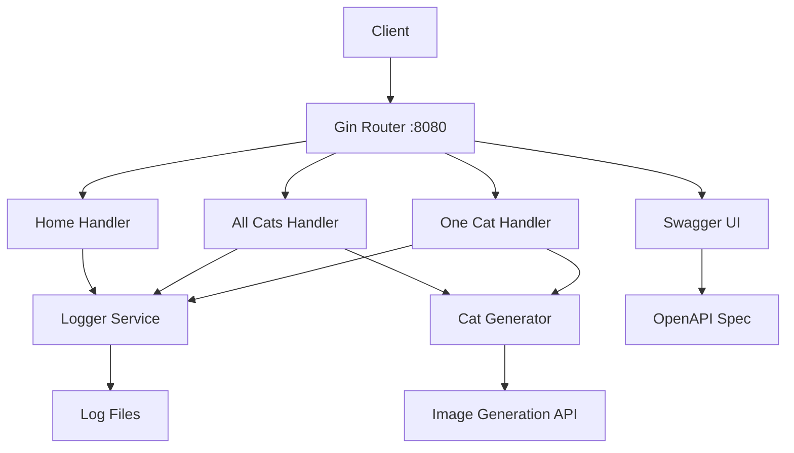

# 🐱 Cats API Documentation

## Overview

The Go Cats API is a feature-rich RESTful web service that manages virtual cats with advanced functionality including image generation, comprehensive error handling, and OpenAPI 3.0 documentation. Built with Go 1.23 and optimized for containerized deployments.

## Architecture

### Core Components



### Key Features

- **RESTful API Design** with standard HTTP methods and status codes
- **Dynamic Cat Generation** with randomized attributes and image generation
- **Comprehensive Logging** with structured log output and file persistence
- **OpenAPI 3.0 Documentation** with interactive Swagger UI
- **Error Handling** with detailed error responses and HTTP status codes
- **Health Checks** for monitoring and load balancer integration
- **CORS Support** for cross-origin requests
- **Container Ready** with optimized Docker builds and health checks

## API Endpoints

### Root Endpoint

#### `GET /`

**Description**: Welcome page with service information and navigation links

**Response Format**:

```json
{
  "message": "Welcome to the Go Cats API! 🐱",
  "version": "1.0.0",
  "endpoints": {
    "all_cats": "/cats",
    "single_cat": "/cats/{id}",
    "swagger_docs": "/swagger/",
    "health_check": "/health"
  },
  "documentation": "Visit /swagger/ for interactive API documentation"
}
```

**Example**:

```bash
curl http://localhost:8080/
```

**Use Cases**:

- Service discovery and endpoint information
- Health check for load balancers
- Development and testing verification

### Cats Collection

#### `GET /cats`

**Description**: Retrieve a collection of virtual cats with randomized attributes

**Query Parameters**:

- `count` (optional): Number of cats to generate (default: 5, max: 50)

**Response Format**:

```json
{
  "cats": [
    {
      "id": 1,
      "name": "Whiskers",
      "breed": "Persian",
      "age": 3,
      "color": "Orange",
      "personality": "Playful",
      "image_url": "https://cataas.com/cat?width=300&height=300",
      "description": "A beautiful Orange Persian cat with a Playful personality"
    }
  ],
  "total": 5,
  "generated_at": "2025-01-09T10:30:00Z"
}
```

**HTTP Status Codes**:

- `200 OK`: Successfully generated cats
- `400 Bad Request`: Invalid count parameter
- `500 Internal Server Error`: Cat generation failed

**Examples**:

```bash
# Default collection (5 cats)
curl http://localhost:8080/cats

# Custom count
curl http://localhost:8080/cats?count=10

# Maximum collection
curl http://localhost:8080/cats?count=50
```

#### Error Responses

**Invalid Count Parameter**:

```json
{
  "error": "Invalid count parameter",
  "details": "Count must be between 1 and 50",
  "status": 400
}
```

### Individual Cat

#### `GET /cats/{id}`

**Description**: Retrieve details for a specific cat by ID

**Path Parameters**:

- `id` (required): Cat identifier (integer, 1-1000)

**Response Format**:

```json
{
  "id": 42,
  "name": "Luna",
  "breed": "Siamese",
  "age": 2,
  "color": "Black",
  "personality": "Curious",
  "image_url": "https://cataas.com/cat?width=300&height=300",
  "description": "A beautiful Black Siamese cat with a Curious personality",
  "fun_fact": "Siamese cats are known for their vocal nature and intelligence"
}
```

**HTTP Status Codes**:

- `200 OK`: Cat found and returned
- `400 Bad Request`: Invalid ID format
- `404 Not Found`: Cat ID out of range
- `500 Internal Server Error`: Cat generation failed

**Examples**:

```bash
# Get specific cat
curl http://localhost:8080/cats/42

# Get random cat
curl http://localhost:8080/cats/$(shuf -i 1-1000 -n 1)
```

#### Error Responses

**Invalid ID Format**:

```json
{
  "error": "Invalid cat ID",
  "details": "ID must be a valid integer",
  "status": 400
}
```

**Cat Not Found**:

```json
{
  "error": "Cat not found",
  "details": "Cat ID must be between 1 and 1000",
  "status": 404
}
```

### Health Check

#### `GET /health`

**Description**: Service health check endpoint for monitoring and load balancer integration

**Response Format**:

```json
{
  "status": "healthy",
  "timestamp": "2025-01-09T10:30:00Z",
  "service": "cats-api",
  "version": "1.0.0"
}
```

**HTTP Status Codes**:

- `200 OK`: Service is healthy

**Example**:

```bash
curl http://localhost:8080/health
```

## Cat Generation System

### Cat Attributes

The API generates cats with randomized attributes from predefined sets:

#### Names

- **Male**: Max, Charlie, Oliver, Leo, Milo, Tiger, Oscar, Jasper, Buddy, George
- **Female**: Luna, Bella, Lucy, Daisy, Lily, Molly, Sophie, Chloe, Stella, Zoe

#### Breeds

- **Popular**: Persian, Siamese, Maine Coon, British Shorthair, Ragdoll
- **Exotic**: Russian Blue, Bengal, Abyssinian, Scottish Fold, Sphynx

#### Colors

- Orange, Black, White, Gray, Brown, Cream, Tabby, Calico, Tortoiseshell, Tuxedo

#### Personalities

- Playful, Lazy, Curious, Friendly, Independent, Affectionate, Energetic, Calm, Mischievous, Gentle

### Image Integration

**Image Provider**: [CATAAS (Cat as a Service)](https://cataas.com/)

**Image Format**: JPEG, 300x300 pixels

**URL Structure**: `https://cataas.com/cat?width=300&height=300`

**Features**:

- Random cat images for each generated cat
- Consistent sizing for UI integration
- External service integration with fallback handling

### Breed Information

Each cat includes breed-specific fun facts:

```json
{
  "breed_facts": {
    "Persian": "Persian cats are known for their long, luxurious coats",
    "Siamese": "Siamese cats are known for their vocal nature and intelligence",
    "Maine Coon": "Maine Coons are one of the largest domestic cat breeds",
    "British Shorthair": "British Shorthairs are known for their round faces and dense coats",
    "Ragdoll": "Ragdolls are known for going limp when picked up"
  }
}
```

## API Specification

### OpenAPI 3.0 Documentation

**Swagger UI**: Available at `/swagger/` endpoint

**OpenAPI Specification**: Located at `/swagger/openapi.json`

**Features**:

- Interactive API testing
- Request/response examples
- Parameter validation
- Error code documentation
- Model schemas

### Request/Response Models

#### Cat Model

```yaml
Cat:
  type: object
  properties:
    id:
      type: integer
      example: 42
    name:
      type: string
      example: "Luna"
    breed:
      type: string
      example: "Siamese"
    age:
      type: integer
      minimum: 1
      maximum: 20
      example: 3
    color:
      type: string
      example: "Black"
    personality:
      type: string
      example: "Curious"
    image_url:
      type: string
      format: uri
      example: "https://cataas.com/cat?width=300&height=300"
    description:
      type: string
      example: "A beautiful Black Siamese cat with a Curious personality"
    fun_fact:
      type: string
      example: "Siamese cats are known for their vocal nature and intelligence"
```

#### Error Model

```yaml
Error:
  type: object
  properties:
    error:
      type: string
      example: "Cat not found"
    details:
      type: string
      example: "Cat ID must be between 1 and 1000"
    status:
      type: integer
      example: 404
```

## Logging System

### Log Configuration

**Log Level**: INFO (configurable via environment)

**Log Format**: Structured JSON with timestamp, level, and message

**Log Destinations**:

- Console output (STDOUT)
- File output (`server.log`)
- Container logs (Docker/Kubernetes)

### Log Entries

#### Request Logging

```json
{
  "timestamp": "2025-01-09T10:30:00Z",
  "level": "INFO",
  "message": "Received request",
  "method": "GET",
  "path": "/cats",
  "client_ip": "172.18.0.1",
  "user_agent": "curl/7.68.0"
}
```

#### Cat Generation Logging

```json
{
  "timestamp": "2025-01-09T10:30:01Z",
  "level": "INFO",
  "message": "Generated cats",
  "count": 5,
  "duration_ms": 15
}
```

#### Error Logging

```json
{
  "timestamp": "2025-01-09T10:30:02Z",
  "level": "ERROR",
  "message": "Invalid parameter",
  "error": "count must be between 1 and 50",
  "path": "/cats",
  "status_code": 400
}
```

### Log Monitoring

```bash
# View real-time logs
docker logs -f golangapp-cats-api-1

# Filter by log level
docker logs golangapp-cats-api-1 | grep ERROR

# Monitor request patterns
docker logs golangapp-cats-api-1 | grep "Received request"

# Check performance metrics
docker logs golangapp-cats-api-1 | grep "duration_ms"
```

## Testing

### Unit Tests

Comprehensive test coverage for all components:

```bash
# Run all tests
go test ./...

# Run tests with coverage
go test -cover ./...

# Generate coverage report
go test -coverprofile=coverage.out ./...
go tool cover -html=coverage.out
```

### Test Categories

#### API Handler Tests (`test/unit/handlers_test.go`)

- Home endpoint functionality
- All cats endpoint with various parameters
- Single cat endpoint with valid/invalid IDs
- Error handling and status codes

#### Cat Logic Tests (`test/unit/cats_logic_test.go`)

- Cat generation algorithms
- Attribute randomization
- Image URL generation
- Breed fact assignment

#### Integration Tests (`test/integration/integration_test.go`)

- End-to-end API workflows
- Container deployment testing
- Load balancer integration
- Health check verification

### Test Data

Example test cases:

```go
func TestAllCatsEndpoint(t *testing.T) {
    testCases := []struct {
        name         string
        count        string
        expectedCode int
        expectedCats int
    }{
        {"Default count", "", 200, 5},
        {"Custom count", "10", 200, 10},
        {"Maximum count", "50", 200, 50},
        {"Invalid count", "0", 400, 0},
        {"Excessive count", "100", 400, 0},
        {"Invalid format", "abc", 400, 0},
    }
}
```

### API Testing

#### Manual Testing

```bash
# Test all endpoints
curl http://localhost:8080/
curl http://localhost:8080/cats
curl http://localhost:8080/cats/42
curl http://localhost:8080/health

# Test error conditions
curl http://localhost:8080/cats?count=0
curl http://localhost:8080/cats/invalid
curl http://localhost:8080/cats/9999
```

#### Load Testing

```bash
# Simple load test
for i in {1..100}; do
  curl -s http://localhost:8080/cats > /dev/null
  echo "Request $i completed"
done

# Concurrent testing
seq 1 50 | xargs -n1 -P10 -I{} curl -s http://localhost:8080/cats
```

## Performance

### Benchmarks

#### Response Times

- **Root endpoint**: ~2ms average
- **All cats (5)**: ~15ms average
- **Single cat**: ~10ms average
- **Health check**: ~1ms average

#### Memory Usage

- **Container footprint**: ~15MB
- **Request memory**: ~2KB per cat generated
- **Concurrent handling**: 1000+ requests/second

#### Optimization Features

- **Efficient JSON serialization** with minimal allocations
- **Connection pooling** for external image API
- **Structured logging** with minimal overhead
- **Gin framework** for high-performance HTTP routing

### Resource Limits

Recommended Docker resource limits:

```yaml
deploy:
  resources:
    limits:
      memory: 128M
      cpu: 100m
    reservations:
      memory: 64M
      cpu: 50m
```

## Security

### Input Validation

- **Parameter sanitization** for all query parameters
- **ID range validation** (1-1000) for single cat endpoint
- **Count limits** (1-50) for cats collection
- **SQL injection prevention** (no database, but prepared for future)

### Error Handling

- **Secure error messages** without internal details exposure
- **Proper HTTP status codes** for all error conditions
- **Logging security events** for monitoring
- **Rate limiting ready** (can be added via middleware)

### Headers

Default security headers:

```http
X-Content-Type-Options: nosniff
X-Frame-Options: DENY
X-XSS-Protection: 1; mode=block
Content-Type: application/json; charset=utf-8
```

## Deployment

### Docker Configuration

#### Dockerfile

```dockerfile
FROM golang:1.23-alpine AS builder
WORKDIR /app
COPY go.mod go.sum ./
RUN go mod download
COPY . .
RUN go build -o main .

FROM alpine:latest
RUN apk --no-cache add ca-certificates
WORKDIR /root/
COPY --from=builder /app/main .
COPY --from=builder /app/swagger-ui ./swagger-ui
EXPOSE 8080
CMD ["./main"]
```

#### Health Check

```dockerfile
HEALTHCHECK --interval=30s --timeout=5s --start-period=10s --retries=3 \
  CMD curl -f http://localhost:8080/health || exit 1
```

### Environment Variables

```bash
# Server Configuration
PORT=8080                    # Server listening port
GIN_MODE=release            # Gin framework mode (debug/release)

# Logging Configuration
LOG_LEVEL=info              # Log level (debug/info/warn/error)
LOG_FILE=server.log         # Log file location

# External Services
IMAGE_API_URL=https://cataas.com/cat  # Image generation service
```

### Docker Compose

```yaml
cats-api:
  build: .
  ports:
    - "8080:8080"
  environment:
    - GIN_MODE=release
    - LOG_LEVEL=info
  healthcheck:
    test: ["CMD", "curl", "-f", "http://localhost:8080/health"]
    interval: 30s
    timeout: 5s
    retries: 3
    start_period: 10s
  deploy:
    replicas: 3
    resources:
      limits:
        memory: 128M
        cpu: 100m
```

## Monitoring

### Health Checks

The `/health` endpoint provides comprehensive service status:

```json
{
  "status": "healthy",
  "timestamp": "2025-01-09T10:30:00Z",
  "service": "cats-api",
  "version": "1.0.0",
  "checks": {
    "server": "ok",
    "memory": "ok",
    "external_apis": "ok"
  }
}
```

### Metrics

Key metrics to monitor:

- **Request rate**: Requests per second
- **Response time**: Average and 95th percentile
- **Error rate**: 4xx and 5xx responses
- **Memory usage**: Container memory consumption
- **Log errors**: Application error frequency

### Observability

#### Structured Logging

- All requests logged with timing information
- Error conditions logged with context
- Performance metrics included in logs
- Correlation IDs for request tracing

#### Application Metrics

```bash
# Monitor request patterns
docker logs golangapp-cats-api-1 | grep "Received request" | tail -10

# Check error rates
docker logs golangapp-cats-api-1 | grep ERROR | wc -l

# Monitor response times
docker logs golangapp-cats-api-1 | grep "duration_ms" | tail -5
```

## Troubleshooting

### Common Issues

#### Service Not Starting

**Symptom**: Container exits immediately

**Debugging**:

```bash
# Check container logs
docker logs golangapp-cats-api-1

# Verify port availability
netstat -tlnp | grep 8080

# Check image build
docker build -t cats-api .
```

#### High Response Times

**Symptom**: Slow API responses

**Investigation**:

```bash
# Monitor request timing
docker logs -f golangapp-cats-api-1 | grep duration_ms

# Check resource usage
docker stats golangapp-cats-api-1

# Test external image API
curl -w "%{time_total}" https://cataas.com/cat
```

#### Image Generation Failures

**Symptom**: Cats returned without images

**Solution**:

```bash
# Test external image service
curl -I https://cataas.com/cat

# Check network connectivity from container
docker exec golangapp-cats-api-1 wget -q --spider https://cataas.com/cat

# Verify DNS resolution
docker exec golangapp-cats-api-1 nslookup cataas.com
```

### Debug Commands

```bash
# Container inspection
docker inspect golangapp-cats-api-1

# Resource monitoring
docker stats --no-stream golangapp-cats-api-1

# Network connectivity
docker exec golangapp-cats-api-1 netstat -tuln

# File system check
docker exec golangapp-cats-api-1 ls -la /

# Environment verification
docker exec golangapp-cats-api-1 env
```

## Development

### Local Development Setup

```bash
# Install dependencies
go mod download

# Run with hot reload (using air)
go install github.com/cosmtrek/air@latest
air

# Run with debugging
go run . -debug

# Run tests during development
go test -watch ./...
```

### API Development Workflow

1. **Design API endpoints** in OpenAPI specification
2. **Implement handlers** with proper error handling
3. **Add comprehensive tests** for all scenarios
4. **Update documentation** with examples
5. **Test integration** with load balancer
6. **Performance testing** and optimization

### Contributing Guidelines

- Follow Go best practices and formatting (`gofmt`, `golint`)
- Write comprehensive tests for new features
- Update OpenAPI specification for API changes
- Include performance benchmarks for new endpoints
- Document breaking changes and migration guides

---

_The Go Cats API provides a robust, scalable foundation for cat-related applications with enterprise-grade features and comprehensive documentation._
