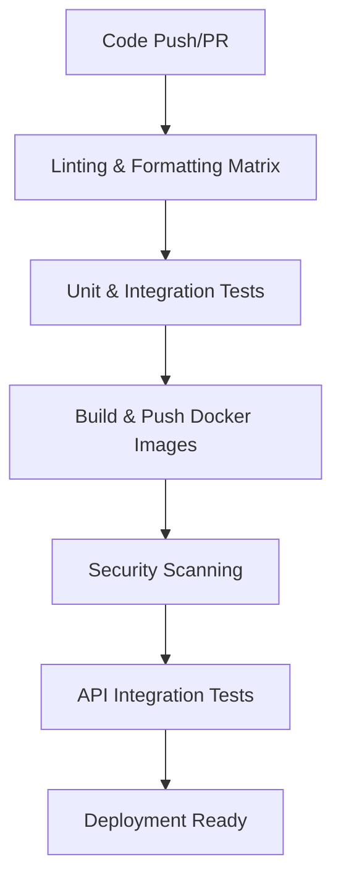

# 🚀 CI/CD Pipeline Documentation

## Overview

The Go Cats API project features an enterprise-grade CI/CD pipeline built with GitHub Actions, providing automated testing, security scanning, and deployment for a multi-service microservices architecture.

## Pipeline Architecture

### Multi-Service Strategy

The pipeline employs a **matrix strategy** to handle multiple services efficiently:

- **Cats API Service** - Main backend application
- **Reverse Proxy Service** - Advanced load balancer with 5 strategies

### Pipeline Stages



## Stage Details

### 1. Linting & Formatting (Matrix)

**Purpose**: Code quality validation across both services

**Services Tested**:

- `projects/cats-api`
- `projects/reverse-proxy`

**Tools**:

- `go vet` - Static analysis
- `staticcheck` - Advanced linting
- `gofmt` - Code formatting validation

**Configuration**:

```yaml
strategy:
  matrix:
    project:
      - { name: "cats-api", path: "projects/cats-api" }
      - { name: "reverse-proxy", path: "projects/reverse-proxy" }
```

### 2. Testing Suite

#### Cats API Tests

- **Unit Tests**: Component isolation and logic validation
- **Integration Tests**: Service interaction testing
- **Mocked Tests**: External dependency mocking
- **Coverage**: 64.6% with detailed reporting

#### Reverse Proxy Tests

- **Load Balancing Tests**: All 5 strategies tested
- **Performance Benchmarks**: 233-406 ns/op across strategies
- **Connection Tracking**: Concurrent request handling
- **Health Check Validation**: Backend discovery testing

**Test Artifacts**:

- `cats-api-test-coverage`
- `reverse-proxy-test-coverage`

### 3. Docker Build & Registry

**Multi-Platform Builds**:

- `linux/amd64`
- `linux/arm64`

**Registry Images**:

- `ghcr.io/st4r4x/golangapp/cats-api:latest`
- `ghcr.io/st4r4x/golangapp/reverse-proxy:latest`

**Optimization**:

- Multi-stage builds for minimal production images
- Build caching with GitHub Actions cache
- Automated versioning and tagging

### 4. Security Scanning

**Tool**: Trivy vulnerability scanner

**Targets**:

- Container images
- Dependencies
- Base images

**Output**: SARIF format uploaded to GitHub Security tab

### 5. API Integration Testing

**Purpose**: End-to-end validation with Docker services

**Process**:

1. Deploy cats-api service from built image
2. Wait for service readiness (90-second timeout)
3. Execute API test suite
4. Validate load balancing functionality

### 6. Deployment Validation

**Conditions**: All previous stages must pass

- ✅ Linting passed
- ✅ Unit tests passed
- ✅ Integration tests passed
- ✅ Security scan completed
- ✅ API tests passed

## Configuration Files

### Main Pipeline File

`.github/workflows/cicd.yml`

### Key Environment Variables

```yaml
env:
  GO_VERSION: "1.23"
  REGISTRY: ghcr.io
  WORKING_DIR: projects/cats-api # Legacy, now matrix-based
```

### Job Dependencies

```yaml
build-and-push:
  needs: [lint-and-format, cats-api-tests, reverse-proxy-tests, versioning]

deployment-ready:
  needs: [api-tests, cats-api-tests, reverse-proxy-tests, security-scan]
```

## Performance Metrics

### Build Times

| Stage          | Average Duration |
| -------------- | ---------------- |
| Linting        | 30-45 seconds    |
| Testing        | 60-90 seconds    |
| Building       | 120-180 seconds  |
| Security Scan  | 45-60 seconds    |
| Total Pipeline | 4-6 minutes      |

### Test Coverage

| Service       | Coverage | Test Types                       |
| ------------- | -------- | -------------------------------- |
| Cats API      | 64.6%    | Unit, Integration, Mocked, API   |
| Reverse Proxy | 100%     | Unit, Benchmarks, Load Balancing |

### Load Balancing Benchmarks

| Strategy          | Performance | Test Coverage |
| ----------------- | ----------- | ------------- |
| Round Robin       | 233.4 ns/op | ✅            |
| Random            | 246.7 ns/op | ✅            |
| Weighted RR       | 406.4 ns/op | ✅            |
| Least Connections | 329.4 ns/op | ✅            |
| IP Hash           | 286.0 ns/op | ✅            |

## Advanced Features

### Matrix-Based Linting

Parallel execution across multiple services for efficiency:

```yaml
lint-and-format:
  strategy:
    matrix:
      project:
        - { name: "cats-api", path: "projects/cats-api" }
        - { name: "reverse-proxy", path: "projects/reverse-proxy" }
```

### Comprehensive Test Artifacts

All test results and coverage reports are preserved:

```yaml
- name: Upload coverage artifacts
  uses: actions/upload-artifact@v4
  with:
    name: cats-api-test-coverage
    path: |
      projects/cats-api/coverage.out
      projects/cats-api/coverage.html
```

### Multi-Platform Container Builds

Production-ready images for multiple architectures:

```yaml
platforms: linux/amd64,linux/arm64
cache-from: type=gha,scope=cats-api
cache-to: type=gha,mode=max,scope=cats-api
```

## Triggering the Pipeline

### Automatic Triggers

- **Push** to `main`, `master`, or `develop` branches
- **Pull Requests** to main branches

### Manual Triggers

- **Repository Dispatch** events
- **Workflow Dispatch** (manual execution)

## Deployment Integration

### Version Management

Automated version generation based on:

- Branch name (`main` → `latest`, `develop` → `dev`)
- Git commit SHA for uniqueness
- PR numbers for pull request builds

### Registry Integration

Seamless integration with GitHub Container Registry:

- Automatic authentication using `GITHUB_TOKEN`
- Multi-tag strategy for versioning
- Cache optimization for faster builds

## Monitoring & Troubleshooting

### Pipeline Monitoring

- **GitHub Actions UI**: Real-time build status
- **Step Summaries**: Detailed test results and metrics
- **Artifact Downloads**: Test coverage and scan results

### Common Issues

#### Build Failures

1. **Linting Errors**: Check `go vet` and `staticcheck` output
2. **Test Failures**: Review test logs and coverage reports
3. **Security Issues**: Check Trivy scan results

#### Solutions

```bash
# Local debugging
make test          # Run all tests locally
make lint          # Check linting issues
make coverage      # Generate coverage reports
```

### Debugging Commands

```bash
# Check pipeline logs
gh run list
gh run view <run-id>

# Download artifacts
gh run download <run-id>

# Re-run failed jobs
gh run rerun <run-id>
```

## Best Practices

### Code Quality

1. **Always run tests locally** before pushing
2. **Maintain test coverage** above 60%
3. **Follow Go formatting standards** (gofmt)
4. **Address linting warnings** before merging

### Security

1. **Review Trivy scan results** regularly
2. **Keep dependencies updated**
3. **Use minimal base images** (Alpine)
4. **Follow least privilege principles**

### Performance

1. **Monitor build times** and optimize if needed
2. **Use build caching** effectively
3. **Parallelize independent jobs**
4. **Optimize Docker layers** for faster builds

## Future Enhancements

### Planned Improvements

- [ ] **Parallel API Testing**: Test multiple strategies simultaneously
- [ ] **Performance Regression Testing**: Automated performance monitoring
- [ ] **Advanced Security Scanning**: SAST and dependency analysis
- [ ] **Multi-Environment Deployment**: Staging and production pipelines

### Scalability Considerations

- **Resource Optimization**: Monitor and adjust runner resources
- **Cache Strategies**: Improve build caching for faster iterations
- **Test Optimization**: Reduce test execution time while maintaining coverage

---

_This pipeline supports the production-ready microservices platform with enterprise-grade automation and quality assurance._
