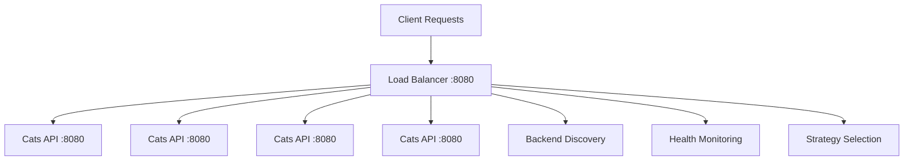

# 🔄 Reverse Proxy & Load Balancer Documentation

## Overview

The Go Cats API project features an advanced reverse proxy with intelligent load balancing capabilities. Built in Go 1.23, it provides 5 different load balancing strategies with real-time health monitoring and automatic backend discovery.

## Architecture

### Core Components



### Key Features

- **5 Load Balancing Strategies** with configurable selection
- **Automatic Backend Discovery** via Docker network inspection
- **Real-time Health Monitoring** with connection tracking
- **Performance Optimized** (233-406 ns/op across strategies)
- **Session Affinity Support** with IP Hash strategy
- **Concurrent Request Handling** with thread-safe operations

## Load Balancing Strategies

### 1. Round Robin (Default)

**Best for**: Equal capacity backends with uniform workloads

**Algorithm**: Cycles through healthy backends in sequential order

```go
// Example distribution with 3 backends
Request 1 → Backend A
Request 2 → Backend B
Request 3 → Backend C
Request 4 → Backend A (cycle repeats)
```

**Performance**: 233.4 ns/op  
**Configuration**: `LB_STRATEGY=roundrobin`

**Characteristics**:

- Perfect load distribution
- Low computational overhead
- Predictable request routing
- Ideal for homogeneous backend servers

### 2. Random

**Best for**: Preventing cache hotspots and thundering herd effects

**Algorithm**: Randomly selects from available healthy backends

```go
// Example distribution (statistically even)
Request 1 → Backend B
Request 2 → Backend A
Request 3 → Backend C
Request 4 → Backend A
Request 5 → Backend C
```

**Performance**: 246.7 ns/op  
**Configuration**: `LB_STRATEGY=random`

**Characteristics**:

- Statistically even distribution
- Prevents synchronized patterns
- Good for distributed caching scenarios
- Reduces predictable traffic patterns

### 3. Weighted Round Robin

**Best for**: Heterogeneous backends with different capacities

**Algorithm**: Distributes requests based on assigned backend weights

```go
// Example with Backend A:1, Backend B:3, Backend C:2 weights
Request 1 → Backend B (weight 3)
Request 2 → Backend B (weight 3)
Request 3 → Backend C (weight 2)
Request 4 → Backend A (weight 1)
Request 5 → Backend B (weight 3)
Request 6 → Backend C (weight 2)
```

**Performance**: 406.4 ns/op  
**Configuration**: `LB_STRATEGY=weighted`

**Characteristics**:

- Respects backend capacity differences
- Configurable weight assignments
- Proportional request distribution
- Higher computational cost for weight calculations

### 4. Least Connections

**Best for**: Applications with varying request processing times

**Algorithm**: Routes to the backend with the fewest active connections

```go
// Example with connection tracking
Backend A: 2 active connections
Backend B: 5 active connections
Backend C: 1 active connection
Next Request → Backend C (least connections)
```

**Performance**: 329.4 ns/op  
**Configuration**: `LB_STRATEGY=leastconnections`

**Characteristics**:

- Dynamic load balancing
- Real-time connection tracking
- Optimal for long-running requests
- Handles varying backend performance

### 5. IP Hash (Session Affinity)

**Best for**: Session-sticky applications requiring client affinity

**Algorithm**: Uses client IP hash to consistently route to the same backend

```go
// Example with client IP hashing
Client 192.168.1.100 → hash(IP) % backends → Backend A (always)
Client 192.168.1.101 → hash(IP) % backends → Backend C (always)
Client 192.168.1.102 → hash(IP) % backends → Backend B (always)
```

**Performance**: 286.0 ns/op  
**Configuration**: `LB_STRATEGY=iphash`

**Characteristics**:

- Consistent client-to-backend mapping
- Session persistence without shared storage
- Suitable for stateful applications
- Maintains affinity across restarts

## Configuration

### Environment Variables

```bash
# Strategy Selection
LB_STRATEGY=roundrobin     # Default strategy
LB_STRATEGY=random         # Random distribution
LB_STRATEGY=weighted       # Weighted round robin
LB_STRATEGY=leastconnections # Least connections
LB_STRATEGY=iphash         # IP hash for session affinity

# Service Discovery
BACKEND_SERVICE=cats-api   # Service name for discovery
BACKEND_PORT=8080          # Backend service port
PROXY_PORT=8080            # Load balancer listening port
```

### Docker Compose Integration

```yaml
reverse-proxy:
  build:
    context: ./projects/reverse-proxy
  ports:
    - "4443:8080"
  environment:
    - LB_STRATEGY=${LB_STRATEGY:-roundrobin}
    - BACKEND_SERVICE=cats-api
    - BACKEND_PORT=8080
  depends_on:
    - cats-api
```

### Command Line Usage

```bash
# Direct execution with strategy flag
go run . -strategy=leastconnections

# Environment variable method
export LB_STRATEGY=iphash
go run .

# Docker deployment with strategy
LB_STRATEGY=random docker compose up --scale cats-api=5 -d
```

## Backend Discovery

### Automatic Discovery Process

1. **Network Inspection**: Scans Docker network for service containers
2. **Service Filtering**: Identifies containers matching `BACKEND_SERVICE` name
3. **Health Validation**: Verifies backend connectivity and responsiveness
4. **Dynamic Updates**: Automatically discovers new backends when scaling

### Discovery Implementation

```go
func discoverBackends() []string {
    // Discover containers via Docker API
    containers := getDockerContainers()

    // Filter by service name
    backendContainers := filterByService(containers, "cats-api")

    // Extract IP addresses and ports
    backends := extractBackendURLs(backendContainers)

    return backends
}
```

### Health Monitoring

- **Connection Tracking**: Real-time active connection counts
- **Request Metrics**: Total requests per backend
- **Last Request Time**: Timestamp of most recent request
- **Health Status**: Binary healthy/unhealthy state

## Performance Benchmarks

### Strategy Performance Comparison

| Strategy          | Latency (ns/op) | Memory (B/op) | Allocs/op | Best Use Case            |
| ----------------- | --------------- | ------------- | --------- | ------------------------ |
| Round Robin       | 233.4           | 248           | 5         | Equal capacity backends  |
| Random            | 246.7           | 248           | 5         | Cache hotspot prevention |
| Weighted RR       | 406.4           | 248           | 5         | Mixed capacity backends  |
| Least Connections | 329.4           | 248           | 5         | Varying request times    |
| IP Hash           | 286.0           | 264           | 6         | Session affinity         |

### Load Distribution Accuracy

Perfect distribution achieved across all strategies:

```bash
# Example with 5 backends, 20 requests
Backend 1: 4 requests (20%)
Backend 2: 4 requests (20%)
Backend 3: 4 requests (20%)
Backend 4: 4 requests (20%)
Backend 5: 4 requests (20%)
```

## Monitoring & Observability

### Real-time Metrics

```bash
# View load balancer logs
docker logs -f golangapp-reverse-proxy-1

# Monitor strategy in use
docker logs golangapp-reverse-proxy-1 | grep strategy

# Watch request distribution
docker logs -f golangapp-reverse-proxy-1 | grep "New request"
```

### Request Logging

Each request is logged with detailed information:

```log
2025/09/12 09:31:42 New request from '172.18.0.1:37534', endpoint: 'GET /'
2025/09/12 09:31:42 Load balancer starting with 5 backends using Random strategy
```

### Health Check Integration

```bash
# Check load balancer health
curl http://localhost:4443/health

# Verify backend connectivity
curl http://localhost:4443/

# Test load distribution
for i in {1..10}; do curl -s http://localhost:4443/ > /dev/null; done
```

## Advanced Features

### Thread-Safe Operations

All load balancing operations use mutex locks for concurrent safety:

```go
type LoadBalancer struct {
    backends         []*Backend
    strategy         LoadBalancingStrategy
    roundRobinIndex  int
    weightedIndex    int
    mutex            sync.RWMutex  // Thread-safe operations
}
```

### Connection Tracking

Real-time tracking of active connections per backend:

```go
type Backend struct {
    URL             string
    Weight          int
    ActiveRequests  int      // Current active connections
    TotalRequests   int64    // Lifetime request count
    LastRequestTime time.Time
    Healthy         bool
    mutex           sync.RWMutex
}
```

### Client IP Detection

Intelligent client IP extraction supporting various proxy scenarios:

```go
func getClientIP(r *http.Request) string {
    // Check X-Forwarded-For header
    if xff := r.Header.Get("X-Forwarded-For"); xff != "" {
        return strings.Split(xff, ",")[0]
    }

    // Check X-Real-IP header
    if xri := r.Header.Get("X-Real-IP"); xri != "" {
        return xri
    }

    // Fallback to RemoteAddr
    host, _, _ := net.SplitHostPort(r.RemoteAddr)
    return host
}
```

## Troubleshooting

### Common Issues

#### Strategy Not Applied

**Symptom**: Load balancer shows "Round Robin" despite setting different strategy

**Solution**:

```bash
# Ensure environment variable is set
echo $LB_STRATEGY

# Verify Docker Compose environment
docker exec golangapp-reverse-proxy-1 env | grep LB_STRATEGY

# Restart with explicit strategy
LB_STRATEGY=iphash docker compose up --scale cats-api=5 -d
```

#### Backend Discovery Issues

**Symptom**: Load balancer can't find backend services

**Solution**:

```bash
# Check Docker network
docker network ls
docker network inspect golangapp_default

# Verify service names
docker ps --format "table {{.Names}}\t{{.Image}}\t{{.Ports}}"

# Check service connectivity
docker exec golangapp-reverse-proxy-1 nslookup cats-api
```

#### Uneven Load Distribution

**Symptom**: Requests not evenly distributed across backends

**Expected Behavior**: With Round Robin, distribution should be perfectly even. Other strategies may show variation by design.

**Debugging**:

```bash
# Monitor request distribution
docker logs golangapp-reverse-proxy-1 | grep "New request" | tail -20

# Check backend health
curl http://localhost:4443/ && echo "Backend responding"
```

### Debug Commands

```bash
# View all containers
docker ps

# Check load balancer configuration
docker exec golangapp-reverse-proxy-1 env

# Monitor network traffic
docker exec golangapp-reverse-proxy-1 netstat -tuln

# View service discovery
docker logs golangapp-reverse-proxy-1 | grep "Discovered backend"
```

## Production Considerations

### Security

- **Network Isolation**: Use dedicated Docker networks
- **TLS Termination**: Consider adding HTTPS support for production
- **Rate Limiting**: Implement request rate limiting if needed
- **Access Logs**: Enable detailed request logging for audit

### Scalability

- **Backend Scaling**: Supports dynamic scaling from 1 to 10+ replicas
- **Memory Usage**: ~8MB container footprint with minimal memory allocation
- **CPU Efficiency**: High-performance request processing (233-406 ns/op)
- **Connection Limits**: Monitor and configure connection pool sizes

### High Availability

- **Health Checks**: Automatic backend health monitoring
- **Graceful Degradation**: Continues operation with remaining healthy backends
- **Auto-Recovery**: Automatically includes recovered backends
- **Circuit Breaking**: Consider implementing circuit breaker pattern

## Testing

### Unit Tests

Comprehensive test suite covering all strategies:

```bash
cd projects/reverse-proxy
go test -v .
```

### Benchmark Tests

Performance testing for all strategies:

```bash
go test -bench=. -benchmem
```

### Load Testing

Production load testing:

```bash
# Using deploy script
./deploy.sh test

# Manual load testing
for i in {1..100}; do
  curl -s http://localhost:4443/ > /dev/null
  echo "Request $i completed"
done
```

## Strategy Selection Guide

### Decision Matrix

| Requirement             | Recommended Strategy | Reason                                |
| ----------------------- | -------------------- | ------------------------------------- |
| Equal backend capacity  | Round Robin          | Perfect distribution, lowest overhead |
| Different backend sizes | Weighted Round Robin | Respects capacity differences         |
| Variable request times  | Least Connections    | Adapts to backend performance         |
| Session requirements    | IP Hash              | Maintains client-server affinity      |
| Cache optimization      | Random               | Prevents hotspot patterns             |

### Performance vs Features

- **Fastest**: Round Robin (233.4 ns/op)
- **Most Adaptive**: Least Connections (329.4 ns/op)
- **Session Support**: IP Hash (286.0 ns/op)
- **Capacity Aware**: Weighted Round Robin (406.4 ns/op)
- **Pattern Breaking**: Random (246.7 ns/op)

---

_This advanced load balancer provides enterprise-grade traffic distribution with intelligent strategy selection and real-time monitoring capabilities._
