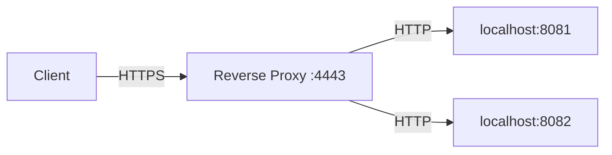

# Reverse Proxy

A simple reverse proxy in Go that performs load balancing to backend servers using a round-robin strategy.

## Features

- **Load Balancing**: Distributes incoming requests to multiple backend servers in round-robin fashion.
- **HTTPS Support**: Serves over HTTPS using provided certificates.
- **Health Check**: Includes a `/ping` endpoint for health checks.
- **Docker Support**: Multi-stage Dockerfile for easy containerization.

## Architecture



## Setup and Running

### Prerequisites

- Go 1.22 or later
- Docker (optional)

### Local Development

1. Ensure your backend servers are running on ports 8081 and 8082.
2. Run the reverse proxy:

   ```bash
   go run .
   ```

3. Access the proxy at `https://localhost:4443` (accept self-signed cert).

### Using Docker

1. Build the image:

   ```bash
   docker build -t reverse-proxy .
   ```

2. Run the container:

   ```bash
   docker run -p 4443:4443 reverse-proxy
   ```

## Configuration

- **Backends**: Configured in `main.go` as `http://localhost:8081` and `http://localhost:8082`.
- **Port**: Listens on 4443 with TLS.
- **Certificates**: Uses `certs/server.crt` and `certs/server.key`.

## Testing

- **Health Check**: `https://localhost:4443/ping`
- **Proxy Requests**: Any other path will be proxied to backends in round-robin.

## Manipulations

- Send requests to the reverse proxy and observe load balancing.
- Stop one backend and verify requests route to the other.
- Uses HTTPS for client connections, HTTP for backends.
