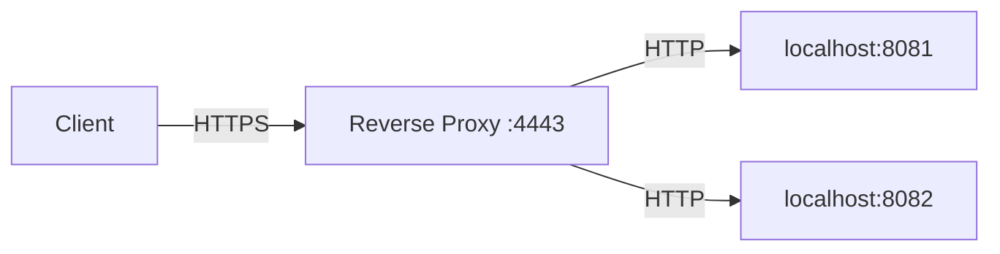

# 🔄 Advanced Load Balancer - Reverse Proxy

## Overview

This is the advanced reverse proxy component of the Go Cats API project. It provides intelligent load balancing with 5 different strategies, health monitoring, and automatic backend discovery.

## 📚 Documentation

For comprehensive documentation about this load balancer, please see:

**[📖 Complete Load Balancer Documentation](../../docs/LOAD_BALANCER.md)**

This includes:

- All 5 load balancing strategies with performance benchmarks
- Configuration options and Docker integration
- Real-time monitoring and health checks
- Advanced features and troubleshooting guides

## Quick Start

````bash
# Start with specific strategy
LB_STRATEGY=leastconnections go run .

# Or use environment variable
export LB_STRATEGY=iphash
go run .

**Characteristics:**

- Statistical load distribution
- Helps avoid synchronized patterns
- Good for distributed caching scenarios

### 3. Weighted Round Robin

**Best for:** Heterogeneous backend servers with different capacities

```go
// Distribution based on backend weights
// backend1:weight=1, backend2:weight=3, backend3:weight=2
backend2 → backend2 → backend3 → backend1 → backend2 → backend3 → ...
````

**Characteristics:**

- Proportional distribution based on server capacity
- Configurable weights per backend
- Ideal for mixed hardware environments

### 4. Least Connections

**Best for:** Variable request processing times and connection-heavy workloads

```go
// Selects backend with fewest active connections
if backend1.active=2, backend2.active=5, backend3.active=1
→ select backend3 (lowest connections)
```

**Characteristics:**

- Dynamic load distribution
- Accounts for request processing time variations
- Best for long-running requests

### 5. IP Hash (Session Affinity)

**Best for:** Stateful applications requiring session persistence

```go
// Consistent hashing based on client IP
hash("192.168.1.100") % backends → always backend2
hash("192.168.1.101") % backends → always backend1
```

**Characteristics:**

- Session persistence (sticky sessions)
- Consistent backend assignment per client
- Maintains state without external storage

## 📊 Enhanced Features

### Real-time Statistics

- **Active Connections:** Live connection count per backend
- **Total Requests:** Cumulative request count
- **Last Request Time:** Backend activity tracking
- **Health Status:** Real-time health monitoring

### Enhanced Status Page

Access detailed load balancer information:

- **`/ping`** - Load balancer status and statistics
- **`/health`** - Health check endpoint (alias for /ping)

### Backend Health Monitoring

- Automatic unhealthy backend detection
- Error-based health status updates
- Automatic recovery when backends become available
- Graceful degradation during failures

### Advanced Error Handling

- Proxy error detection and logging
- Automatic backend marking for failures
- Graceful fallback mechanisms
- Detailed error reporting

## 🔧 Configuration

### Environment Variables (Future Enhancement)

```bash
LB_STRATEGY=round_robin     # round_robin, random, weighted, least_conn, ip_hash
LB_HEALTH_CHECK=true        # Enable health checks
LB_STATS_ENABLED=true       # Enable statistics collection
```

### Current Implementation

- **Strategy:** Round Robin (configurable in code)
- **Weight:** Equal weight (1) for all backends
- **Health Checks:** Automatic error-based detection

## 🧪 Testing

### Unit Tests

Comprehensive test suite covering:

```bash
cd projects/reverse-proxy
go test -v                  # Run all tests
go test -bench=.            # Run performance benchmarks
```

**Test Coverage:**

- ✅ All load balancing strategies
- ✅ Backend health management
- ✅ Connection tracking
- ✅ Error handling
- ✅ Client IP detection
- ✅ Statistical accuracy

### Benchmark Results

```
BenchmarkLoadBalancer_RoundRobin-12              5,059,134 ops    229.2 ns/op
BenchmarkLoadBalancer_Random-12                  4,927,933 ops    233.6 ns/op
BenchmarkLoadBalancer_LeastConnections-12        3,610,862 ops    318.9 ns/op
BenchmarkLoadBalancer_IPHash-12                  4,182,502 ops    271.7 ns/op
BenchmarkLoadBalancer_WeightedRoundRobin-12      2,961,255 ops    394.5 ns/op
```

### Load Testing

```bash
# Test round-robin distribution
./deploy.sh test

# Manual load testing
for i in {1..100}; do curl -s http://localhost:4443/ > /dev/null; done
```

## 🚀 Performance Characteristics

### Memory Usage

- **Round Robin:** ~229 ns/op, 248 B/op, 5 allocs/op
- **Random:** ~234 ns/op, 248 B/op, 5 allocs/op
- **Least Connections:** ~319 ns/op, 248 B/op, 5 allocs/op
- **IP Hash:** ~272 ns/op, 264 B/op, 6 allocs/op
- **Weighted Round Robin:** ~395 ns/op, 248 B/op, 5 allocs/op

### Throughput

- **Round Robin:** Highest throughput (5M+ ops/sec)
- **Random:** Near-optimal performance
- **IP Hash:** Good performance with consistency benefits
- **Least Connections:** Moderate performance with dynamic benefits
- **Weighted Round Robin:** Lower throughput due to calculation overhead

## 🔍 Monitoring & Observability

### Metrics Available

- **Backend Status:** Health, active connections, total requests
- **Load Distribution:** Request count per backend
- **Performance:** Response times and error rates
- **Strategy Effectiveness:** Load balancing algorithm performance

### Logging

Enhanced logging includes:

- Strategy selection notifications
- Backend discovery events
- Request routing decisions
- Error conditions and recovery

### Health Checks

- **Passive Health Checks:** Error-based detection
- **Active Health Checks:** Endpoint monitoring (future)
- **Circuit Breaker:** Automatic failure isolation (future)

## 🛠️ Advanced Usage

### Custom Strategy Selection

```go
// Configure strategy during initialization
strategy := LeastConnections  // or RoundRobin, Random, etc.
loadBalancer = NewLoadBalancer(strategy)
```

### Backend Weight Configuration

```go
// Add backends with custom weights
lb.AddBackend("http://high-capacity-server:8080", 3)
lb.AddBackend("http://standard-server:8080", 1)
```

### Connection Tracking

```go
// Automatic connection management
backend.IncrementConnections()  // On request start
defer backend.DecrementConnections()  // On request end
```

## 📈 Production Recommendations

### Strategy Selection Guide

- **Uniform Backends:** Round Robin
- **Mixed Capacity:** Weighted Round Robin
- **Variable Load:** Least Connections
- **Session State:** IP Hash
- **Cache Optimization:** Random

### Monitoring Setup

1. Enable detailed logging
2. Monitor `/health` endpoint
3. Track backend distribution patterns
4. Set up alerting for backend failures

### Performance Tuning

1. Choose strategy based on workload characteristics
2. Configure appropriate backend weights
3. Monitor connection patterns
4. Optimize for your specific use case

## 🔮 Future Enhancements

- **Configurable Strategies:** Environment variable configuration
- **Active Health Checks:** Proactive backend monitoring
- **Circuit Breaker Pattern:** Automatic failure isolation
- **Metrics Export:** Prometheus/Grafana integration
- **Load Prediction:** ML-based traffic prediction
- **Geographic Routing:** Location-aware load balancing

## Features

- **Load Balancing**: Distributes incoming requests to multiple backend servers in round-robin fashion.
- **HTTPS Support**: Serves over HTTPS using provided certificates.
- **Health Check**: Includes a `/ping` endpoint for health checks.
- **Docker Support**: Multi-stage Dockerfile for easy containerization.

## Architecture



## Setup and Running

### Prerequisites

- Go 1.22 or later
- Docker (optional)

### Local Development

1. Ensure your backend servers are running on ports 8081 and 8082.
2. Run the reverse proxy:

   ```bash
   go run .
   ```

3. Access the proxy at `https://localhost:4443` (accept self-signed cert).

### Using Docker

1. Build the image:

   ```bash
   docker build -t reverse-proxy .
   ```

2. Run the container:

   ```bash
   docker run -p 4443:4443 reverse-proxy
   ```

## Configuration

- **Backends**: Configured in `main.go` as `http://localhost:8081` and `http://localhost:8082`.
- **Port**: Listens on 4443 with TLS.
- **Certificates**: Uses `certs/server.crt` and `certs/server.key`.

## Testing

- **Health Check**: `https://localhost:4443/ping`
- **Proxy Requests**: Any other path will be proxied to backends in round-robin.

## Manipulations

- Send requests to the reverse proxy and observe load balancing.
- Stop one backend and verify requests route to the other.
- Uses HTTPS for client connections, HTTP for backends.
